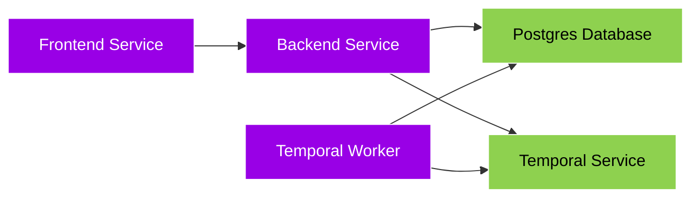

## Architecture

GrowChief is composed of 3 main services and 2 external services - all 5 of the main services typically run within a **single docker container**, and talk to each other through HTTP. Those 4 main servers typically talk to other containers, running the external services - the SQL Database, Redis Queue and Storage.

- [Frontend](#frontend) - Provides the Web user interface, talks to the Backend.
- [Backend](#backend) - Does all the real work, provides an API for the frontend, and posts work to the redis queue.
- [Workers](#worker) - Consumes work from the Temporal Service.

- [Temporal Service](#temporal) - A simple queue for the workers to consume work from.
- [SQL Database](#db) - Stores all the data, Postgres is typically used, but any SQL database can be used.

### Frontend

The frontend is the part that you see, the web interface make with React Vite.

### Backend

The backend is the "brain" of GrowChief, and coordinates all the work. Typically the SQL database it talks to is Postgres, but other databases can be used.

### Worker

The worker process the queue and automate your social media accounts.
